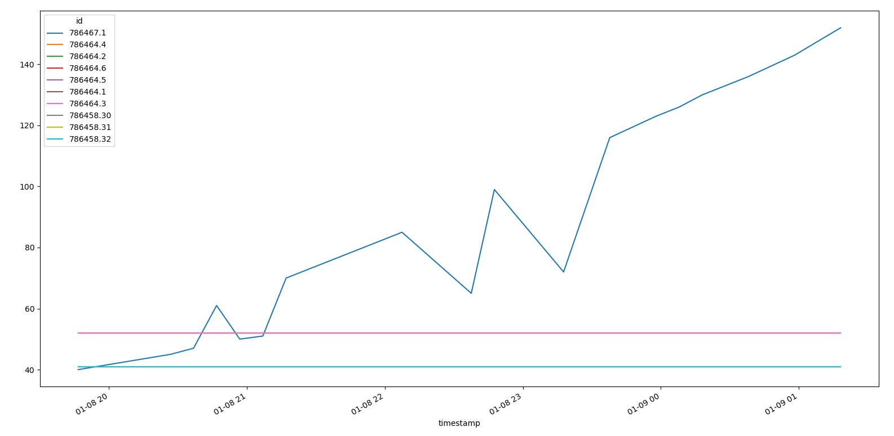
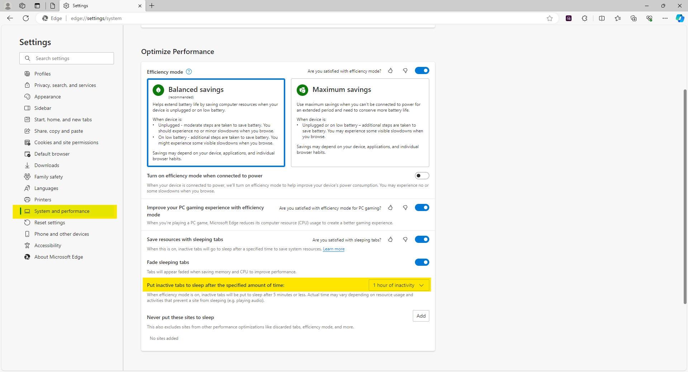

# mongoose_issue_debug

Repo for debugging unbounded memory growth issue with mongoose WebSockets

## Environment

- mongoose version: 7.12
- Compiler/IDE and SDK: gcc version 11.4.0
- Target hardware/board: Linux 5.15.0-91-generic x86_64

## Setup

We are running the Mongoose web server to provide HTTP and WebSocket service for an embedded device. For this testing, we replicated it on a generic Ubuntu server to ensure easy reproducibility.

Our client application uses WebSockets to subscribe to a data-stream from our backend. After the initial subscription, the backend is expected to continuously serve updates until mongoose detects a disconnect (MG_EV_CLOSE). 

For a minimal reproducible example, we set mongoose to wake on timer and send data over the active WebSocket connections (In our actual implementation, the timer callback calls a select on a localhost socket to see if information is available and should be forwarded over the WebSocket). This removes the connection from mongoose to our backend but functionally serves the same purpose.

## Bug Symptom

The following figure is a graph of memory (RAM) usage over time for various processes from 2023-01-08T19:30Z to 2023-01-09T01:30Z. A period of roughly 6 hours. The Y-Axis is in MegaBytes. The blue process (PID 786467) is mongoose. The memory useage of mongoose will continue to grow until all available memory is consumed.

## Bug Cause

Through our own debugging we have nailed down the specific cause of the issue.

Microsoft Edge (and other browsers) have a feature to "Put inactive tabs to sleep" automatically after a period of non-interaction. Edge specifically enables this by default whereas Google Chrome has this disabled by default.

This sleep state seems to have an odd effect on the WebSocket connection. It does not send a disconnect but also does not continue processing the WebSocket. From the server side, the system TCP buffer begins to fill up as soon as the browser tab goes to sleep. We are not sure but we presume this to mean that the client is no longer ACKing packets and that the server is attempting to automatically buffer and retransmit them as TCP is designed to do.

For a period of time, there is no visible issue. The server TCP buffer is filling but mongoose does not know (or care) about this. It continues to do its job in transmitting data; however, eventually the TCP buffer is completely filled. Mongoose DOES recognize this (via `mg_iotest` and either EPOLL or some OS-dependant variation) and sets the `is_writeable` flag to False. This tells mongoose to stop calling `mg_io_send` (which wraps the OS `send`).

This is where a very useful feature of mongoose becomes a curse. Typically when a high-level send call is made (i.e. `mg_ws_send`) mongoose will `calloc` a buffer for all data to be sent and then drain some or all of the buffer each `mg_poll` cycle. This allows sending arbitrarily large amounts of data to the (relatively) small OS TCP buffer. We  use this feature ourselves to enable the sending of 300kB blobs of data without needing to manually split it into TCP-buffer-sized chunks.

With the TCP buffer filled and not draining, mongoose's internal buffering takes over and begins growing in size. Each new call to `mg_ws_send` will cause the internal buffering to allocate more and more memory. This growth is completely unbounded. As long as you keep calling `mg_ws_send`, it will keep growing.

From what we have seen, this issue NEVER resolves itself. We have a logfile of a system that was in this state for over 10 days before it ran out of RAM and crashed.

If the browser page is reopened, the connection will drain normally and all used memory will be freed by the garbage collector.

If the browser page is closed, the connection will be dropped and all used memory will be freed by the garbage collector

## Reproducing

[This repo](https://github.com/EndlessDex/mongoose_issue_debug) contains a minimal example to reproduce the issue.

There are three real files:

1. mongoose_main.cpp: source file for the webserver
1. nonsense.h: a garbage string to send over the WebSocket
1. index.html: basic webpage that will open a WebSocket and append all received message to `<body>`

The other files are compilation related. If you have cmake, the example can be built by running `make mongoose` in the root directory of the repo. `make run` will start the mongoose server. `make all` will do both.

On the browser side, using Microsoft Edge you can set the amount of time before a tab goes to sleep in the settings. The timout can be set as low as 30 seconds.

With the example running, open the webpage with Edge. You should see text begin to appear once the WebSocket connection is established. Now minimize the browser. This will cause the tab to go to sleep after a short time (though not exactly the time specified in the settings).

Each call to `WebSocketSend` will be logged as well as the mongoose TX and RX buffer sizes. Initially the `write_conn` calls are also visible though they go away after the TCP buffer fills and `is_writeable` becomes permanently false. Once this happens the TX buffer can be seen to increase linearly for the rest of the runtime.

A logfile of this is attached [here](./logfile.txt).

- See line 831 for the beginning of buffer growth.
- See line 1382 for when the browser was reopened.
- Note that 1,845,248 bytes had accumulated at this time.
